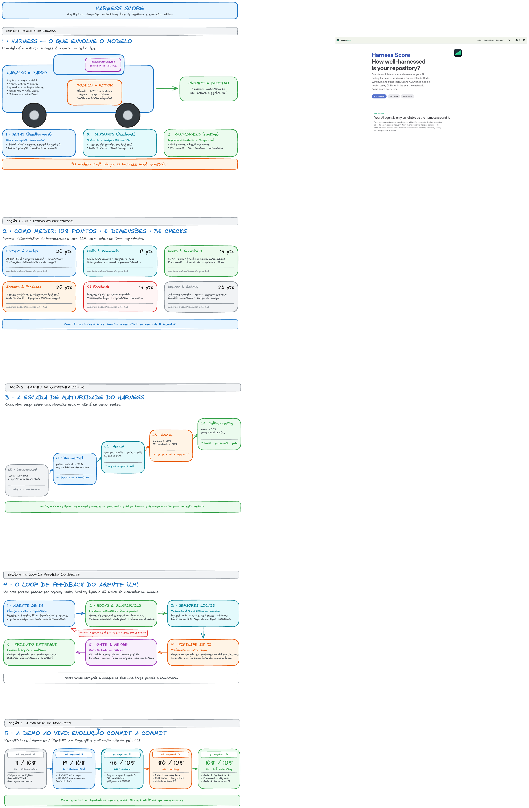

# Harness para agentes de IA: o que é e como medir com o Harness Score

▶️ **Vídeo:** [https://youtu.be/WnFJ3Tr545w](https://youtu.be/WnFJ3Tr545w)

Material do vídeo: o que é um harness em volta de um agente de IA e como medi-lo
com o [harness-score](https://github.com/paladini/harness-score) (Paladini).



## Estrutura


| Arquivo/pasta        | O que é                                                                                                                                               |
| -------------------- | ----------------------------------------------------------------------------------------------------------------------------------------------------- |
| `demo-repo/`         | Projeto Python (`textkit`) que evolui de **L0 a L4** via commits com tags `l0`…`l4`, cada nível validado com a CLI real (11 → 19 → 46 → 80 → 108 pts) |
| `desenho.png`        | Diagrama usado no vídeo                                                                                                                               |
| `desenho.excalidraw` | Fonte editável do diagrama (abre no [excalidraw.com](https://excalidraw.com))                                                                         |


## Demo rápida

```sh
cd demo-repo
git log --oneline --decorate        # vê as tags l0..l4
git checkout l0 && npx harness-score
git checkout l4 && npx harness-score
```

## Diagrama

Um arquivo só, com 5 seções empilhadas:

1. O que é um harness (guias · sensores · guardrails)
2. 108 pontos, 6 dimensões, 36 checks
3. A escada L0→L4 e os gates de cada nível
4. O loop de feedback do agente
5. A timeline do `demo-repo` com os scores reais

